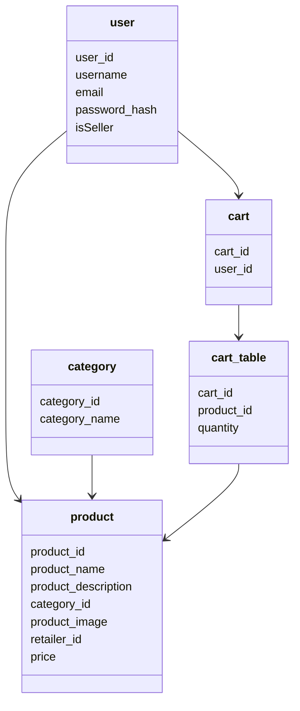

# E-elan | Projet 48h Nantes Ynov Campus

### Objectif du projet 
Le but de ce projet est de proposer, en 48 heures chrono, un Proof of Concept de boutique en ligne décentralisée permettant aux petits et moyens commerçants de se libérer des gros marketplaces centralisés. 

## Installation 
Vous devez avoir installé [Node.js](https://nodejs.org/en/) et [Git](https://git-scm.com/downloads) sur votre machine.
```
git clone https://github.com/hervouetdylan/e-elan.git
```
## Utilisation
Lancer le projet
````bash
cd front
npm install
npm start
````
```bash
Vous devez avoir axios et express
cd back
npm install
npm start
```

## Fonctionnalités
* Création de compte
* Connexion (pas encore finalisée)
* Affichage des produits
* Recherche de produits

## API 
*  Toutes les données sont stockées dans une base de données MySql hébergée sur 000webhost [API](https://e-elan48.000webhostapp.com/products.php).

## Diagramme de classes


## Explication du projet
Le projet consiste en la création d'une boutique en ligne décentralisée. Le projet est composé de deux parties : le front et le back. Le front est une application React qui permet de visualiser les produits et de les ajouter au panier. Le back est une API créee avec php qui permet de récupérer les données de la base de données.

    
## Outils utilisés
* [VsCode](https://code.visualstudio.com)  
* [Github](https://github.com)
* [MySql](https://www.mysql.com)
* [Figma](https://www.figma.com/files/recent?fuid=1178085169079461508)
* [React](https://reactjs.org)
* [Docker](https://www.docker.com)
* [MySql](https://www.mysql.com)
* [express](https://expressjs.com/fr/)
* [phpMyAdmin](https://www.phpmyadmin.net)
* [php](https://www.php.net)
* [000webhost](https://www.000webhost.com)
* [Axios](https://www.npmjs.com/package/axios)
## Présentation équipe 
* Gracieux ALHONSOU KOUMAGNON B3
* Alvin LUCAS B3
* Yassine ENNOUHI B2
* Dylan HERVOUET B2
* Matias BELLAUD B1
* Louis ROUXELIN B1
